# ABPlayer 架构文档

ABPlayer 是一款专为语言学习者设计的 macOS 本地音频播放器，提供高效的 A-B 复读、逐句精听和练习时间统计功能。

---

## 目录
1. [系统架构概览](#系统架构概览)
2. [技术栈](#技术栈)
3. [项目结构](#项目结构)
4. [数据模型层](#数据模型层)
5. [服务层](#服务层)
6. [视图层](#视图层)
7. [业务逻辑详解](#业务逻辑详解)
8. [数据流](#数据流)
9. [测试覆盖](#测试覆盖)

---

## 系统架构概览

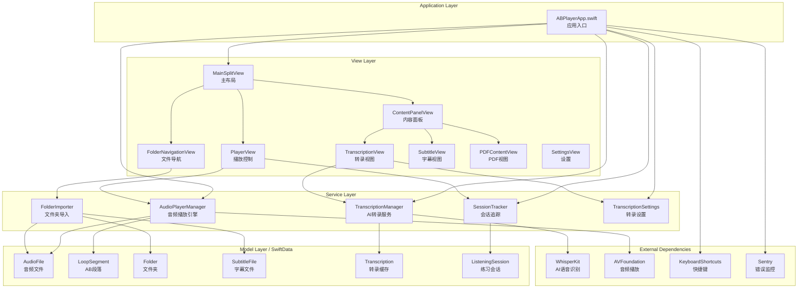

---

## 技术栈

| 分类 | 技术 | 说明 |
|------|------|------|
| **语言** | Swift 6.2 | 使用最新 Swift 并发特性 |
| **UI 框架** | SwiftUI | NavigationSplitView, @Observable |
| **数据持久化** | SwiftData | @Model 宏，自动保存 |
| **项目管理** | [Tuist](https://tuist.io/) | 模块化项目生成 |
| **AI 引擎** | [WhisperKit](https://github.com/argmaxinc/WhisperKit) | CoreML 离线语音识别 |
| **快捷键** | KeyboardShortcuts | 全局热键支持 |
| **错误监控** | Sentry | 生产环境错误追踪 |

---

## 项目结构

```text
ABPlayer/
├── ABPlayer/
│   ├── Sources/
│   │   ├── ABPlayerApp.swift        # 应用入口
│   │   ├── Design/                  # 设计系统
│   │   │   ├── Theme.swift          # 主题颜色
│   │   │   └── Typography.swift     # 字体样式
│   │   ├── Models/                  # 数据模型
│   │   │   ├── AudioModels.swift    # AudioFile, LoopSegment
│   │   │   ├── Folder.swift         # 文件夹模型
│   │   │   ├── SubtitleFile.swift   # 字幕文件+解析器
│   │   │   └── Transcription.swift  # 转录缓存
│   │   ├── Services/                # 业务服务
│   │   │   ├── AudioPlayerManager.swift    # 播放引擎
│   │   │   ├── SessionTracker.swift        # 会话追踪
│   │   │   ├── TranscriptionManager.swift  # AI转录
│   │   │   ├── TranscriptionSettings.swift # 转录设置
│   │   │   ├── FolderImporter.swift        # 文件夹导入
│   │   │   └── ShortcutNames.swift         # 快捷键定义
│   │   └── Views/                   # 视图组件
│   │       ├── MainSplitView.swift        # 主分栏视图
│   │       ├── PlayerView.swift           # 播放器视图
│   │       ├── FolderNavigationView.swift # 文件夹导航
│   │       ├── ContentPanelView.swift     # 内容面板
│   │       ├── TranscriptionView.swift    # AI转录视图
│   │       ├── SubtitleView.swift         # 字幕列表
│   │       ├── PDFContentView.swift       # PDF阅读
│   │       ├── SettingsView.swift         # 设置界面
│   │       └── Components/                # 通用组件
│   ├── Tests/                       # 单元测试
│   │   ├── ABPlayerTests.swift      # 播放器测试
│   │   └── TranscriptionTests.swift # 转录测试
│   └── Resources/                   # 资源文件
├── Docs/                            # 文档
├── scripts/                         # 构建脚本
└── Project.swift                    # Tuist 项目配置
```

---

## 数据模型层

### 实体关系图

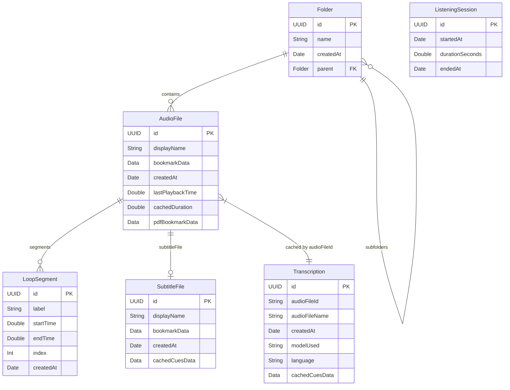

### 模型详解

| 模型 | 文件路径 | 说明 |
|------|----------|------|
| **AudioFile** | [AudioModels.swift](file:///Volumes/Data/Code/mine/ABPlayer/ABPlayer/Sources/Models/AudioModels.swift#L4-L57) | 音频文件，存储 Security-Scoped Bookmark |
| **LoopSegment** | [AudioModels.swift](file:///Volumes/Data/Code/mine/ABPlayer/ABPlayer/Sources/Models/AudioModels.swift#L59-L87) | A-B 循环段落，关联到 AudioFile |
| **Folder** | [Folder.swift](file:///Volumes/Data/Code/mine/ABPlayer/ABPlayer/Sources/Models/Folder.swift) | 文件夹，支持嵌套结构 |
| **SubtitleFile** | [SubtitleFile.swift](file:///Volumes/Data/Code/mine/ABPlayer/ABPlayer/Sources/Models/SubtitleFile.swift#L19-L59) | 字幕文件 (SRT/VTT)，含解析器 |
| **Transcription** | [Transcription.swift](file:///Volumes/Data/Code/mine/ABPlayer/ABPlayer/Sources/Models/Transcription.swift) | AI 转录缓存 |
| **ListeningSession** | [SessionTracker.swift](file:///Volumes/Data/Code/mine/ABPlayer/ABPlayer/Sources/Services/SessionTracker.swift#L5-L23) | 练习时间会话 |

---

## 服务层

### 服务依赖图

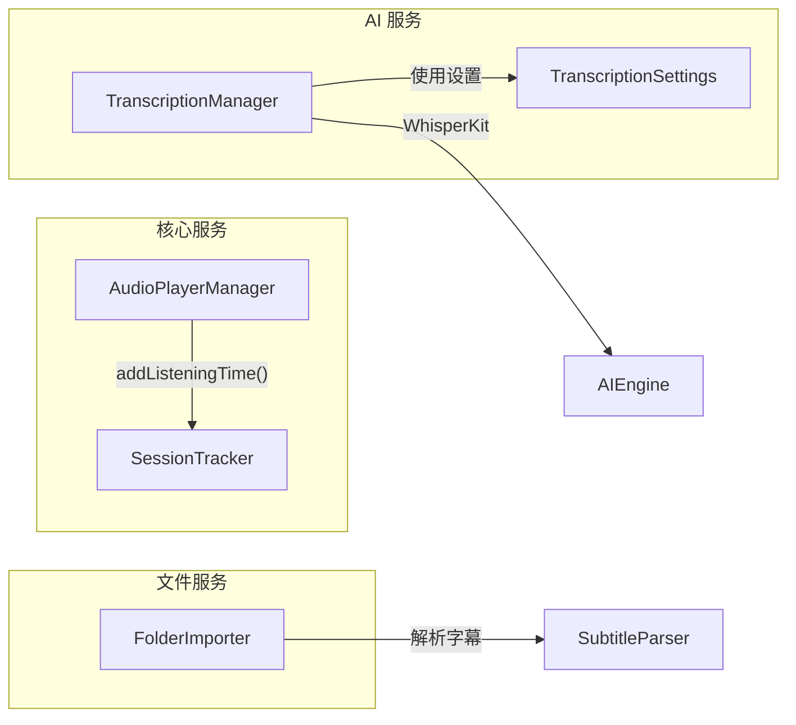

### 服务详解

#### 1. AudioPlayerManager

**路径**: [AudioPlayerManager.swift](file:///Volumes/Data/Code/mine/ABPlayer/ABPlayer/Sources/Services/AudioPlayerManager.swift)

**职责**:
- 音频播放控制 (播放/暂停/跳转)
- A-B 循环管理 (设置点 A/B、循环检测)
- 段落管理 (保存/删除/导航)
- 播放进度持久化

**关键方法**:

| 方法 | 行号 | 说明 |
|------|------|------|
| `load(audioFile:fromStart:)` | [L93-155](file:///Volumes/Data/Code/mine/ABPlayer/ABPlayer/Sources/Services/AudioPlayerManager.swift#L93-L155) | 加载音频文件 |
| `togglePlayPause()` | - | 播放/暂停 |
| `setPointA()` / `setPointB()` | - | 设置 A/B 点 |
| `saveCurrentSegment()` | [L274-296](file:///Volumes/Data/Code/mine/ABPlayer/ABPlayer/Sources/Services/AudioPlayerManager.swift#L274-L296) | 保存当前 AB 段落 |
| `selectPreviousSegment()` / `selectNextSegment()` | [L330-365](file:///Volumes/Data/Code/mine/ABPlayer/ABPlayer/Sources/Services/AudioPlayerManager.swift#L330-L365) | 段落导航 |

---

#### 2. SessionTracker

**路径**: [SessionTracker.swift](file:///Volumes/Data/Code/mine/ABPlayer/ABPlayer/Sources/Services/SessionTracker.swift)

**职责**:
- 追踪练习时间
- 自动创建/结束会话
- 定期持久化 (每5秒)

**关键方法**:

| 方法 | 行号 | 说明 |
|------|------|------|
| `startSessionIfNeeded()` | [L39-47](file:///Volumes/Data/Code/mine/ABPlayer/ABPlayer/Sources/Services/SessionTracker.swift#L39-L47) | 开始新会话 |
| `addListeningTime(_:)` | [L49-73](file:///Volumes/Data/Code/mine/ABPlayer/ABPlayer/Sources/Services/SessionTracker.swift#L49-L73) | 累加练习时间 |
| `endSessionIfIdle()` | [L112-133](file:///Volumes/Data/Code/mine/ABPlayer/ABPlayer/Sources/Services/SessionTracker.swift#L112-L133) | 结束会话 |

---

#### 3. TranscriptionManager

**路径**: [TranscriptionManager.swift](file:///Volumes/Data/Code/mine/ABPlayer/ABPlayer/Sources/Services/TranscriptionManager.swift)

**职责**:
- 加载 WhisperKit 模型
- 执行音频转录
- 管理转录状态

**状态机**:

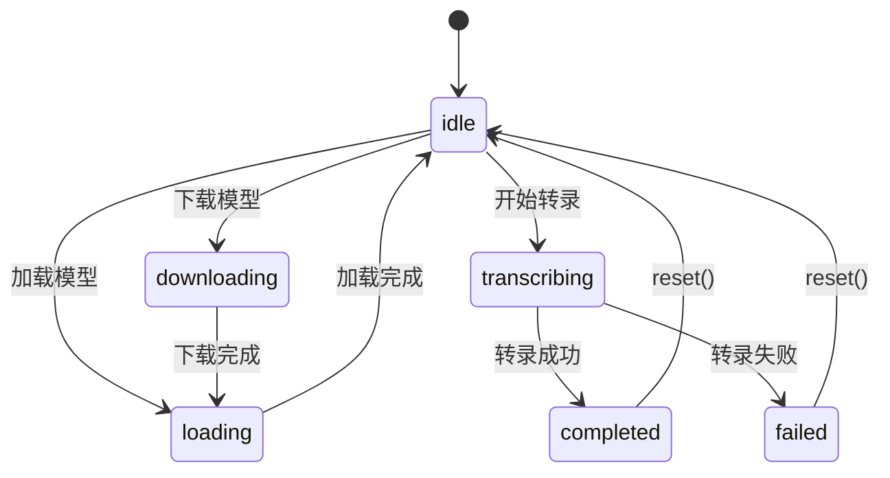

---

#### 4. FolderImporter

**路径**: [FolderImporter.swift](file:///Volumes/Data/Code/mine/ABPlayer/ABPlayer/Sources/Services/FolderImporter.swift)

**职责**:
- 递归导入文件夹
- 自动配对音频与字幕/PDF
- 创建 Security-Scoped Bookmarks

**自动配对规则**:
- 音频扩展名: `mp3`, `m4a`, `wav`, `aac`
- 字幕扩展名: `srt`, `vtt`
- 同名文件自动关联

---

## 视图层

### 视图层次结构

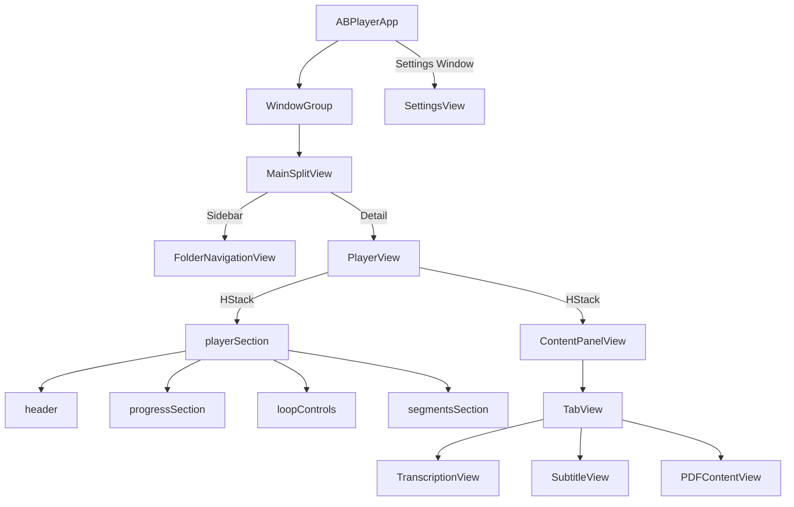

### 视图详解

| 视图 | 文件路径 | 说明 |
|------|----------|------|
| **MainSplitView** | [MainSplitView.swift](file:///Volumes/Data/Code/mine/ABPlayer/ABPlayer/Sources/Views/MainSplitView.swift) | NavigationSplitView 主布局 |
| **PlayerView** | [PlayerView.swift](file:///Volumes/Data/Code/mine/ABPlayer/ABPlayer/Sources/Views/PlayerView.swift) | 播放控制、进度条、AB段落 |
| **FolderNavigationView** | [FolderNavigationView.swift](file:///Volumes/Data/Code/mine/ABPlayer/ABPlayer/Sources/Views/FolderNavigationView.swift) | 侧边栏文件夹/文件导航 |
| **ContentPanelView** | [ContentPanelView.swift](file:///Volumes/Data/Code/mine/ABPlayer/ABPlayer/Sources/Views/ContentPanelView.swift) | 右侧内容面板容器 |
| **TranscriptionView** | [TranscriptionView.swift](file:///Volumes/Data/Code/mine/ABPlayer/ABPlayer/Sources/Views/TranscriptionView.swift) | AI 转录界面 |
| **SubtitleView** | [SubtitleView.swift](file:///Volumes/Data/Code/mine/ABPlayer/ABPlayer/Sources/Views/SubtitleView.swift) | 字幕列表显示 |
| **PDFContentView** | [PDFContentView.swift](file:///Volumes/Data/Code/mine/ABPlayer/ABPlayer/Sources/Views/PDFContentView.swift) | PDF 文档阅读 |
| **SettingsView** | [SettingsView.swift](file:///Volumes/Data/Code/mine/ABPlayer/ABPlayer/Sources/Views/SettingsView.swift) | 应用设置界面 |

---

## 业务逻辑详解

### 1. A-B 循环播放

**文件**: [AudioPlayerManager.swift](file:///Volumes/Data/Code/mine/ABPlayer/ABPlayer/Sources/Services/AudioPlayerManager.swift)

**流程**:

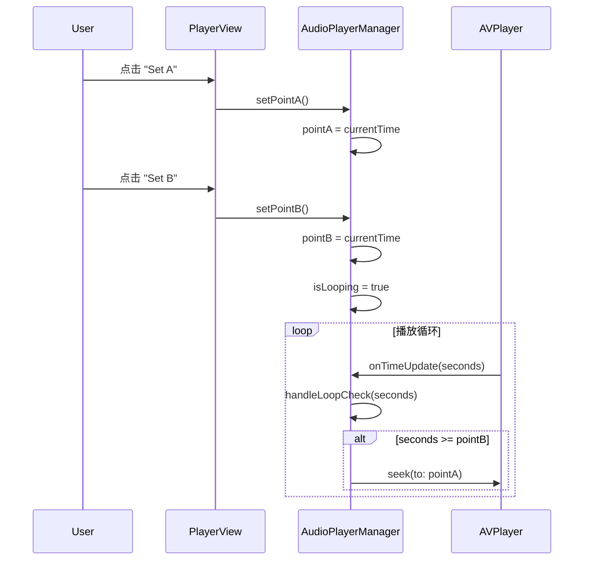

**核心逻辑** ([L367-377](file:///Volumes/Data/Code/mine/ABPlayer/ABPlayer/Sources/Services/AudioPlayerManager.swift#L367-L377)):
```swift
private func handleLoopCheck(_ seconds: Double) {
    guard isLooping, let pointA, let pointB else { return }
    if seconds >= pointB {
        seek(to: pointA)
    }
}
```

---

### 2. 段落保存与导航

**文件**: [AudioPlayerManager.swift](file:///Volumes/Data/Code/mine/ABPlayer/ABPlayer/Sources/Services/AudioPlayerManager.swift)

**保存流程**:
1. 验证 `pointA` 和 `pointB` 有效 (B > A)
2. 检查是否存在重复段落
3. 创建 `LoopSegment` 并关联到 `AudioFile`
4. 自动设置标签 (Segment 1, 2, 3...)

**导航流程**:
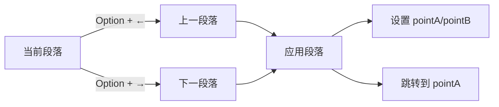

---

### 3. 练习时间追踪

**文件**: [SessionTracker.swift](file:///Volumes/Data/Code/mine/ABPlayer/ABPlayer/Sources/Services/SessionTracker.swift)

**流程**:

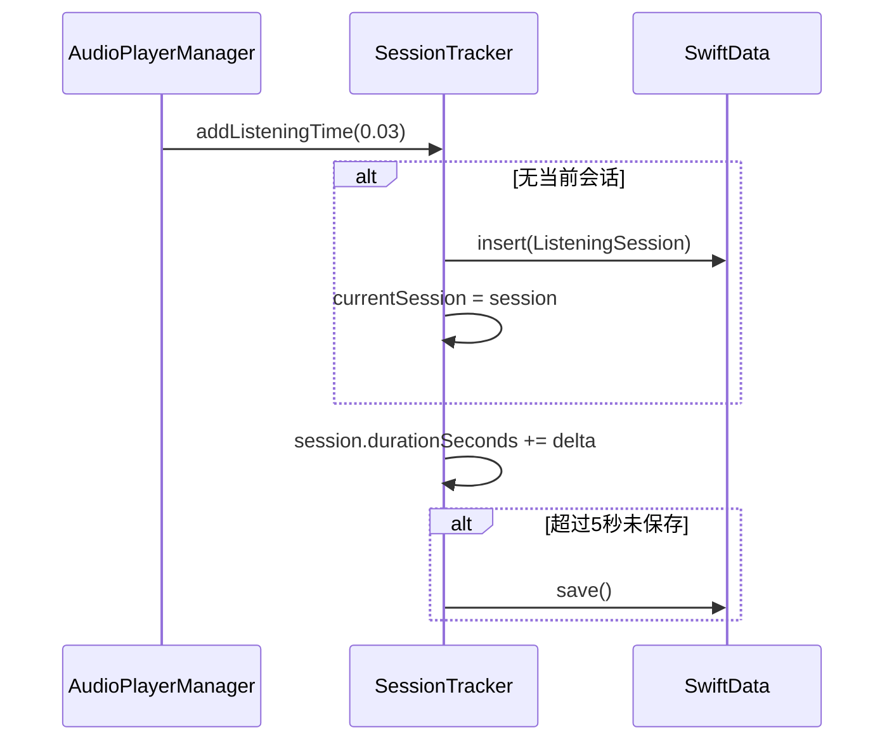

---

### 4. AI 转录

**文件**: [TranscriptionManager.swift](file:///Volumes/Data/Code/mine/ABPlayer/ABPlayer/Sources/Services/TranscriptionManager.swift)

**流程**:

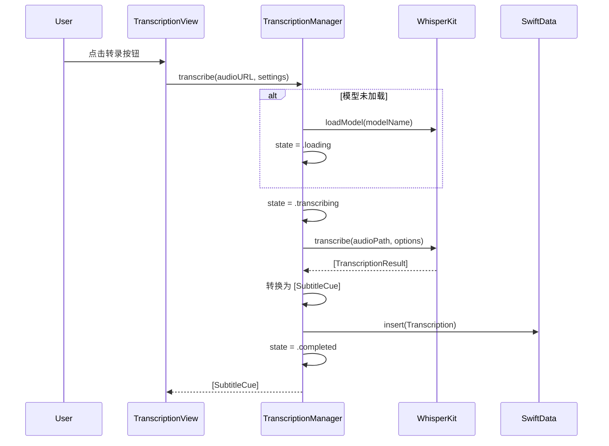

---

### 5. 文件夹导入

**文件**: [FolderImporter.swift](file:///Volumes/Data/Code/mine/ABPlayer/ABPlayer/Sources/Services/FolderImporter.swift)

**流程**:

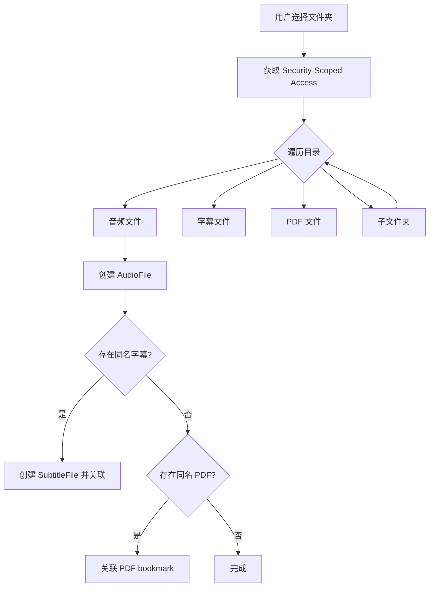

---

### 6. 键盘快捷键

**文件**: [ShortcutNames.swift](file:///Volumes/Data/Code/mine/ABPlayer/ABPlayer/Sources/Services/ShortcutNames.swift), [ABPlayerApp.swift](file:///Volumes/Data/Code/mine/ABPlayer/ABPlayer/Sources/ABPlayerApp.swift#L33-L86)

| 快捷键 | 功能 | 注册位置 |
|--------|------|----------|
| `Space` / `Option+Space` | 播放/暂停 | ABPlayerApp L36-40 |
| `Option+X` | 设置 A 点 | ABPlayerApp L52-56 |
| `Option+C` | 设置 B 点 | ABPlayerApp L58-62 |
| `Option+V` | 清除循环 | ABPlayerApp L64-68 |
| `Option+B` | 保存段落 | ABPlayerApp L70-74 |
| `Option+←` | 上一段落 | ABPlayerApp L76-80 |
| `Option+→` | 下一段落 | ABPlayerApp L82-86 |
| `Option+F` | 后退 5 秒 | ABPlayerApp L42-46 |
| `Option+G` | 前进 10 秒 | ABPlayerApp L48-52 |

---

## 数据流

### 依赖注入

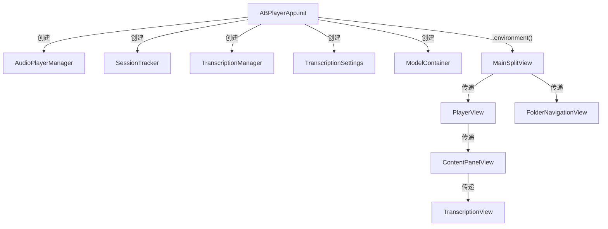

### 状态更新流

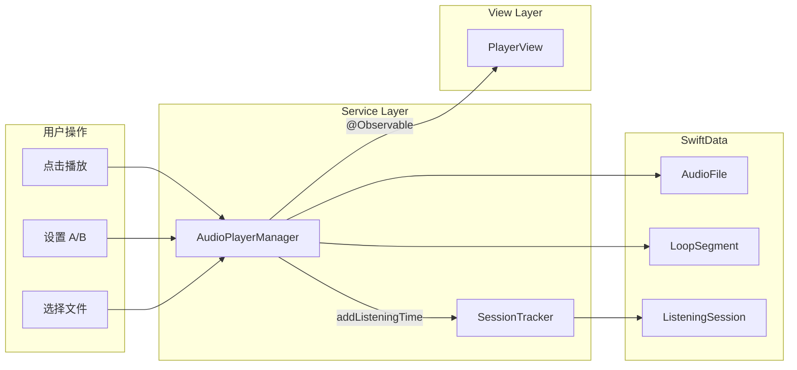

---

## 测试覆盖

### 现有测试

| 测试文件 | 测试内容 |
|----------|----------|
| [ABPlayerTests.swift](file:///Volumes/Data/Code/mine/ABPlayer/ABPlayer/Tests/ABPlayerTests.swift) | 循环索引、排序、选择同步 |
| [TranscriptionTests.swift](file:///Volumes/Data/Code/mine/ABPlayer/ABPlayer/Tests/TranscriptionTests.swift) | 字幕编码、转录状态、设置管理 |

### 待添加测试

以下业务逻辑建议补充单元测试：

1. **A-B 循环逻辑测试**
   - `setPointA()` / `setPointB()` 边界条件
   - `handleLoopCheck()` 循环检测

2. **SessionTracker 测试**
   - 会话创建/结束
   - 时间累加准确性

3. **FolderImporter 测试**
   - 文件配对逻辑
   - 递归目录处理

4. **SubtitleParser 测试**
   - SRT 格式解析
   - VTT 格式解析
   - 时间戳解析
