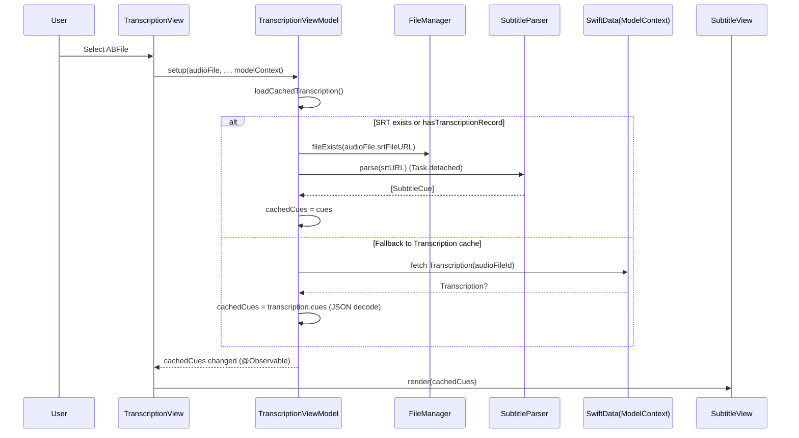

# 字幕存储与读取逻辑梳理

本文梳理 ABPlayer 当前字幕（Subtitles/Transcription）的存储形态、读取优先级、写入路径、以及与播放同步的关键流程。内容基于现有实现行为，而非理想设计。

## 范围与术语

- `SubtitleCue`：内存中的字幕 cue（起止时间 + 文本），也是数据库/缓存的序列化单位。
- `SubtitleParser`：SRT/VTT 解析与 SRT 写入。
- `SubtitleFile`：SwiftData 实体；用于“导入/配对”的字幕文件（bookmark + 可选的解析缓存）。
- `Transcription`：SwiftData 实体；用于“AI 转录”结果的缓存（按 `audioFileId` 索引）。
- “SRT 文件”：与音频同目录同名的 `*.srt`（由 `ABFile.srtFileURL` 推导）。

关联代码入口（建议从这里读起）：

- `ABPlayer/Sources/Models/SubtitleFile.swift`
- `ABPlayer/Sources/Models/Transcription.swift`
- `ABPlayer/Sources/Models/AudioModels.swift`
- `ABPlayer/Sources/Services/FolderImporter.swift`
- `ABPlayer/Sources/Services/TranscriptionQueueManager.swift`
- `ABPlayer/Sources/ViewModels/TranscriptionViewModel.swift`
- `ABPlayer/Sources/Views/TranscriptionView.swift`
- `ABPlayer/Sources/Views/SubtitleView.swift`
- `ABPlayer/Sources/Views/Subtitle/SubtitleViewModel.swift`

## 数据结构与持久化形态

### 1) `SubtitleCue`

位置：`ABPlayer/Sources/Models/SubtitleFile.swift`

- `Codable + Identifiable + Equatable`
- 字段：`id: UUID`、`startTime: Double`、`endTime: Double`、`text: String`

### 2) SwiftData：`SubtitleFile`

位置：`ABPlayer/Sources/Models/SubtitleFile.swift`

- `@Model final class SubtitleFile`
- 关键字段：
  - `bookmarkData: Data`（`@Attribute(.externalStorage)`）：字幕文件的 security-scoped bookmark
  - `cachedCuesData: Data?`（`@Attribute(.externalStorage)`）：解析后的 `[SubtitleCue]`，以 JSON 编码缓存
  - `audioFile: ABFile?`：与音频文件的关系
- `cues: [SubtitleCue]`：计算属性
  - 读：`JSONDecoder().decode([SubtitleCue].self, from: cachedCuesData)`，失败则返回 `[]`
  - 写：`JSONEncoder().encode(newValue)`，失败则写入 `nil`

用途现状：`FolderImporter` 在导入时会创建/关联 `SubtitleFile`，并将解析后的 cues 缓存在 `cachedCuesData`；但当前字幕展示读取路径主要走 “SRT 文件 / `Transcription` 缓存”，并未直接读取 `audioFile.subtitleFile?.cues`。

### 3) SwiftData：`Transcription`

位置：`ABPlayer/Sources/Models/Transcription.swift`

- `@Model final class Transcription`
- 关键字段：
  - `audioFileId: String`：使用 `ABFile.id.uuidString`
  - `cachedCuesData: Data?`（`@Attribute(.externalStorage)`）：解析后的 `[SubtitleCue]`，以 JSON 编码缓存
  - 其他：`audioFileName`、`createdAt`、`modelUsed`、`language`
- `cues: [SubtitleCue]`：与 `SubtitleFile.cues` 相同的 JSON 编解码方式

用途现状：当 AI 转录完成后，会 upsert `Transcription`，供后续快速读取。

### 4) 文件系统：同名 `.srt`

位置：`ABPlayer/Sources/Models/AudioModels.swift`

- `ABFile.srtFileURL` 由音频实际路径推导：`audioURL.deletingPathExtension().appendingPathExtension("srt")`
- AI 转录完成后会写入该位置（见 `TranscriptionQueueManager.saveTranscriptionResult`）

## 读取逻辑（字幕展示）

字幕展示入口：`TranscriptionView` -> `TranscriptionViewModel` -> `SubtitleView`

位置：`ABPlayer/Sources/ViewModels/TranscriptionViewModel.swift`

读取优先级（当前实现）：

1. 优先尝试读取 SRT 文件（同名 `.srt`）
   - 条件：`audioFile.hasTranscriptionRecord == true` 或者 `FileManager.fileExists(atPath: audioFile.srtFileURL?.path ?? "")`
   - 实际加载：`loadSRTFile(audioFile:)` -> `SubtitleParser.parse(from: srtURL)`
   - 解析在 `Task.detached` 中执行（避免阻塞主线程）
2. 若 SRT 不存在或解析失败，则回退读取 SwiftData `Transcription` 缓存
   - `FetchDescriptor<Transcription>(predicate: audioFileId == audioFile.id.uuidString)`
   - `cachedCues = cached.cues`（JSON 解码）

注意点：

- 当前读取路径不检查 `audioFile.subtitleFile`（即使导入时已建立 `SubtitleFile` 关系也不会展示）。
- 解析失败与格式未知时，`SubtitleParser.parse` 返回空数组或抛错；调用方普遍采用 `try?` 并回退。

## 写入逻辑（字幕产生与缓存）

字幕数据进入系统目前有两条主路径。

### 路径 A：导入/同步文件夹（配对字幕文件）

位置：`ABPlayer/Sources/Services/FolderImporter.swift`

- 扫描文件夹得到 `subtitleFiles`（包含 `.srt`/`.vtt`）
- 同名匹配：以 baseName（不含扩展名）匹配字幕文件
- 若找到并且 `audioFile.subtitleFile == nil`：
  - 创建 `SubtitleFile(displayName, bookmarkData, audioFile)`
  - `startAccessingSecurityScopedResource()` 后 `SubtitleParser.parse(from: url)`
  - 写入 `subtitleFile.cues`（触发 JSON 编码缓存到 `cachedCuesData`）
  - `modelContext.insert(subtitleFile)` 并设置 `audioFile.subtitleFile = subtitleFile`
- 若未找到但 `audioFile.subtitleFile` 存在：
  - 删除 `SubtitleFile` 实体并解除关系

### 路径 B：AI 转录（生成字幕 + 导出 SRT + 缓存 DB）

位置：`ABPlayer/Sources/Services/TranscriptionQueueManager.swift`

转录完成后保存：`saveTranscriptionResult(audioFileId:audioFileName:cues:bookmarkData:)`

- 文件系统：
  - 解析 bookmark 得到音频 URL，并开启 security scope
  - 写 `audio.srt`：`SubtitleParser.writeSRT(cues:to:)`
- SwiftData：
  - `FetchDescriptor<Transcription>(audioFileId == uuidString)`
  - 存在则更新 `existing.cues`、`createdAt`、`modelUsed`、`language`
  - 否则 insert 新 `Transcription`
  - `context.save()`
- 标记位：
  - 再次 fetch `ABFile`，设置 `audioFile.hasTranscriptionRecord = true` 并保存

## 解析与格式支持

位置：`ABPlayer/Sources/Models/SubtitleFile.swift`

- `detectFormat(from:)`：仅基于扩展名识别：`srt` / `vtt` / `unknown`
- `parse(from:)`：`String(contentsOf: url, encoding: .utf8)`
  - `.srt` -> `parseSRT(_:)`：按空行分 block；第二行解析时间戳；第三行开始拼接文本
  - `.vtt` -> `parseVTT(_:)`：跳过 `WEBVTT` header；按空行分 block；定位包含 `-->` 的时间戳行
- 时间戳：
  - SRT 使用 `,` 作为毫秒分隔符；VTT 使用 `.`
  - 内部会将分隔符归一化为 `.` 再进行 `:` 拆分
  - 支持 `HH:MM:SS.mmm` 与 `MM:SS.mmm` 两类（实现通过 `components.count == 3/2` 区分）
- 写入：仅实现 SRT writer（`writeSRT`）

## 并发与线程边界

- `TranscriptionViewModel` 标注 `@MainActor`（状态更新发生在主线程）
- 解析 SRT 文件：`loadSRTFile` 内部使用 `Task.detached { try SubtitleParser.parse(from: srtURL) }`，避免同步 IO/解析卡住 UI
- 播放同步：`SubtitleViewModel.trackPlayback(...)` 在 `while !Task.isCancelled` 循环中每 100ms 轮询 `PlayerManager.currentTime`，并用二分查找定位 active cue

## 删除与清理（与字幕相关）

位置：`ABPlayer/Sources/Services/DeletionService.swift`

- 删除音频文件时：
  - 若存在 `file.subtitleFile`，会解析其 bookmark 并尝试从磁盘删除对应字幕文件
  - 会删除 `SubtitleFile` 实体
  - 会按 `audioFileId` 删除 `Transcription` 实体

当前实现未显式删除由 AI 转录写出的同名 `*.srt` 文件（它与音频同目录同名）。如果音频文件被删除但目录仍保留，该 `*.srt` 可能成为残留文件。

## Mermaid：流程图（读写全链路）

```mermaid
flowchart TD
  %% Read path (UI)
  R0[TranscriptionView.task(id: audioFile.id)] --> R1[TranscriptionViewModel.setup()]
  R1 --> R2[loadCachedTranscription()]
  R2 --> R3{SRT exists<br/>OR hasTranscriptionRecord?}
  R3 -->|Yes| R4[loadSRTFile()<br/>security-scoped access]
  R4 --> R5[SubtitleParser.parse(srtURL)]
  R5 --> R6[cachedCues = cues]
  R3 -->|No or parse failed| R7[Fetch Transcription<br/>by audioFileId]
  R7 --> R8[cachedCues = transcription.cues<br/>(JSON decode)]
  R6 --> R9[SubtitleView renders cues]
  R8 --> R9

  %% Write paths
  subgraph W[Write Paths]
    W0[FolderImporter.processAudioFile] --> W1{Find matching<br/>.srt/.vtt by baseName}
    W1 -->|Found & not paired| W2[Create SubtitleFile + bookmark]
    W2 --> W3[SubtitleParser.parse(subtitleURL)]
    W3 --> W4[subtitleFile.cues = cues<br/>(JSON encode cachedCuesData)]
    W4 --> W5[audioFile.subtitleFile = subtitleFile]
    W1 -->|Not found but paired| W6[Delete SubtitleFile + unlink]

    T0[TranscriptionQueueManager.saveTranscriptionResult] --> T1[SubtitleParser.writeSRT -> audio.srt]
    T0 --> T2[Upsert Transcription.cues<br/>(JSON encode cachedCuesData)]
    T2 --> T3[Set audioFile.hasTranscriptionRecord = true]
  end
```

## Mermaid：时序图（打开文件后加载字幕）



## 现实行为与潜在缺口（按“当前实现”记录）

- `FolderImporter` 会识别并配对 `.vtt`，但 `TranscriptionViewModel` 的读取路径只尝试 `audioFile.srtFileURL`（即同名 `.srt`）与 `Transcription` 缓存；这意味着“只有 VTT、没有同名 SRT”时，字幕可能不会在当前 UI 中展示。
- `SubtitleFile.cues` 与 `Transcription.cues` 都采用 `try? JSONDecoder/Encoder`，编码/解码失败将静默变为 `[]` 或丢失缓存（对排查问题不友好，但符合当前代码行为）。
- 删除音频时会删除 `SubtitleFile` 的原字幕文件与 `Transcription` 记录，但不会显式删除同名 `*.srt`（AI 导出产物），可能留下残留文件。
