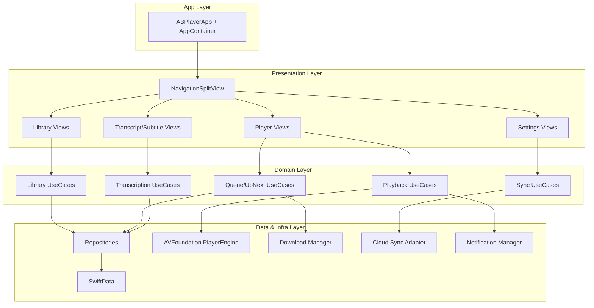

# ABPlayer System Design (Reference: macOS Apple Podcasts)

## 1. 目标与范围

本文档为 ABPlayer 当前仓库提供一份可落地的系统设计，参考最新 macOS Apple Podcasts 的交互与系统能力，并结合 ABPlayer 既有优势（A-B 循环、本地文件学习流、转录与字幕能力）。

目标不是 1:1 复制 Apple Podcasts，而是引入其成熟的系统模式：

- 三栏导航与稳定信息架构
- `Playing Next`（手动队列）与 `Up Next`（自动推荐队列）分离
- Show 级别设置（排序、隐藏已播放、自动下载、播放速度）
- 设备同步（关注、播放进度、站点/队列元数据）
- 下载与通知体系
- 转录阅读、检索与时间戳分享

## 2. 现状评估（以仓库为准）

### 2.1 当前可编译主干

当前 `ABPlayer/Sources` 仅包含最小应用骨架：

- `ABPlayer/Sources/ABPlayerApp.swift`
- `ABPlayer/Sources/Views/MainSplitView.swift`
- `ABPlayer/Sources/Views/SidebarView.swift`
- `ABPlayer/Sources/Views/ContentView.swift`
- `ABPlayer/Sources/Models/MenuItem.swift`

这意味着当前主干尚未接入播放、持久化、同步、下载等业务能力。

### 2.2 可复用能力来源

`old/` 目录中存在可复用的成熟实现（需迁移而非直接依赖）：

- 播放引擎与编排：`old/Services/PlayerManager/*`
- 队列与循环模式：`old/Services/PlaybackQueue.swift`
- SwiftData 模型：`old/Models/*`
- 学习会话与进度持久化：`old/Services/SessionTracker.swift`
- 转录相关：`old/Services/TranscriptionManager.swift`

## 3. 参考基线（Apple Podcasts 能力）

基于 Apple 官方 Podcasts User Guide（macOS Tahoe/Sequoia）提炼的系统要点：

- `Playing Next` 与 `Up Next` 明确区分
- 侧边栏信息架构：Home / Library / Search，以及 Saved、Downloaded、Shows、Stations
- Station（规则聚合）能力：按节目、顺序、是否隐藏已播、每节目条数等规则生成
- Show/Episode 粒度设置：排序、自动下载、移除已播放下载、自定义速度
- 跨设备同步：关注、订阅、站点、播放位置
- 转录支持：全文查看、文本检索、从时间戳分享
- 通知支持：按 Show 管理新集提醒

## 4. 目标系统架构

### 4.1 分层与模块



### 4.2 目录建议（迁移后）

```text
ABPlayer/Sources/
  App/
  Features/
    Library/
    Playback/
    Queue/
    Transcript/
    Settings/
    Sync/
  Shared/
    Models/
    Repositories/
    Infrastructure/
```

## 5. 核心领域模型

### 5.1 实体

- `Show`
  - 表示一个节目集合（ABPlayer 可先映射为导入目录/逻辑节目）
  - 关联 `ShowSettings`、`Episode`
- `Episode`
  - 可播放项（本地文件为主，后续可扩展 RSS/远程）
  - 关键状态：`saved`、`downloadState`、`playedState`
- `PlaybackRecord`
  - `lastPosition`、`completionCount`、`lastPlayedAt`
- `LoopSegment`
  - ABPlayer 差异化能力，绑定到 `Episode`
- `ShowSettings`
  - `episodeOrder`、`hidePlayed`、`autoDownloadPolicy`、`playbackSpeed`
- `Station`
  - 规则定义（节目集合 + 排序 + 每节目条数 + 媒体类型 + 隐藏已播）

### 5.2 队列模型（重点）

```swift
struct QueueState {
    var nowPlaying: Episode?
    var playingNext: [Episode] // 用户手动排队
    var upNext: [Episode]      // 系统自动推荐
}
```

行为约束：

1. 播放结束后优先消费 `playingNext`
2. `playingNext` 为空时再消费 `upNext`
3. A-B 循环激活时，当前 Episode 内循环优先于跨 Episode 跳转

## 6. 关键子系统设计

### 6.1 播放子系统

- `PlayerEngineProtocol`（Actor）隔离 AVFoundation 细节
- `PlaybackCoordinator`（MainActor）维护 UI 可观察状态
- 状态机：`idle -> loading -> ready -> playing/paused -> ended/error`

### 6.2 队列与推荐子系统

- `ManualQueueService` 管理 `Play Next` / `Add to Queue`
- `UpNextService` 根据以下输入生成候选：
  - Followed Shows
  - 最近播放记录
  - 未播放优先
  - ShowSettings 过滤与排序

### 6.3 数据与持久化

- 主存储：SwiftData（实体关系与查询）
- 配置存储：`UserDefaults` / `@AppStorage`（轻量配置）
- 文件访问：Security-scoped bookmark
- 事务原则：播放位置与会话数据做增量持久化（例如每 1-5 秒）

### 6.4 下载管理

- `DownloadManager` 维护任务状态：`queued/downloading/downloaded/failed`
- 全局策略 + Show 覆盖策略
- 支持自动清理已播放下载

### 6.5 同步与通知

- `SyncManager`
  - 同步对象：关注状态、播放位置、站点定义、ShowSettings
  - 冲突策略：播放进度取最大时间戳；配置项最后写入胜出
- `NotificationManager`
  - 按 Show 粒度开关通知
  - 与 macOS 系统通知中心集成

### 6.6 转录与学习能力

- `TranscriptService`
  - 支持全文展示与检索
  - 支持“从当前时间戳分享”
- 与 A-B 循环联动：可从选中文本直接设定循环区间（后续增强）

## 7. 视图与交互架构

### 7.1 三栏信息架构

- Sidebar：Home / Library / Search / Settings
- Content Column：Show/Station/Episode 列表
- Detail Column：Episode 详情、播放器、转录面板

### 7.2 Library 子视图

- `Shows`
- `Saved`
- `Downloaded`
- `Stations`

### 7.3 播放面板

- 主播放器控制（速率、跳转、睡眠定时器）
- `Playing Next` 抽屉（可重排、可移除）
- `Up Next` 卡片（可加入 `Playing Next`）

## 8. 非功能需求

- 性能：首屏渲染 < 1s（缓存命中场景），播放控制响应 < 100ms
- 可靠性：播放进度崩溃恢复；下载任务可恢复
- 可维护性：严格 MVVM/UseCase/Repository 边界
- 可观测性：关键链路埋点（播放、队列、下载、转录）

## 9. 渐进式迁移计划

### Phase 0: 骨架对齐

- 在 `ABPlayer/Sources` 建立 `Features/Shared/App` 目录结构
- 保持当前 UI 可运行

### Phase 1: 播放与模型回迁

- 从 `old/` 迁移并重构：`PlayerEngine`、`PlayerManager`、`ABFile/LoopSegment/PlaybackRecord`
- 在新结构下建立最小可播放闭环

### Phase 2: 队列系统升级

- 引入 `playingNext + upNext` 双队列
- 完成 `Play Next` / `Add to Queue` / 拖拽重排

### Phase 3: Apple Podcasts 对齐能力

- ShowSettings、Stations、Saved/Downloaded 视图
- 转录检索与时间戳分享

### Phase 4: 同步与通知

- 引入同步通道（本地优先，云端可选）
- 完成按 Show 通知管理

## 10. 风险与决策

- 风险 1：`old/` 代码直接复用导致边界污染
  - 对策：迁移时按模块解耦，避免“整体搬运”
- 风险 2：队列与 A-B 循环逻辑冲突
  - 对策：定义统一优先级（A-B > Playing Next > Up Next）
- 风险 3：同步冲突造成状态回退
  - 对策：为播放位置和配置项定义不同冲突策略

## 11. 验收标准

- 架构层面：
  - 模块边界清晰，`View -> ViewModel/UseCase -> Repository` 单向依赖
  - 播放、队列、下载、同步职责分离
- 功能层面：
  - 可演示 `Playing Next` 与 `Up Next` 差异行为
  - 支持 Saved / Downloaded / ShowSettings 基础链路
  - 转录可检索，支持时间戳分享入口

## 12. 参考资料

- Apple Podcasts User Guide（macOS）
  - https://support.apple.com/en-ca/guide/podcasts/welcome/mac
  - https://support.apple.com/en-ca/guide/podcasts/pod64adbf9aa/mac
  - https://support.apple.com/en-ca/guide/podcasts/poddc095ed0b/mac
  - https://support.apple.com/en-ca/guide/podcasts/poda4f6be01/mac
  - https://support.apple.com/en-ca/guide/podcasts/pod48cadb787/mac
  - https://support.apple.com/en-ca/guide/podcasts/pode3855ee98/mac
  - https://support.apple.com/en-ca/guide/podcasts/pod5c911347/mac
  - https://support.apple.com/en-ca/guide/podcasts/pod9d786e746/mac
  - https://support.apple.com/en-ca/guide/podcasts/pod53101237/mac
