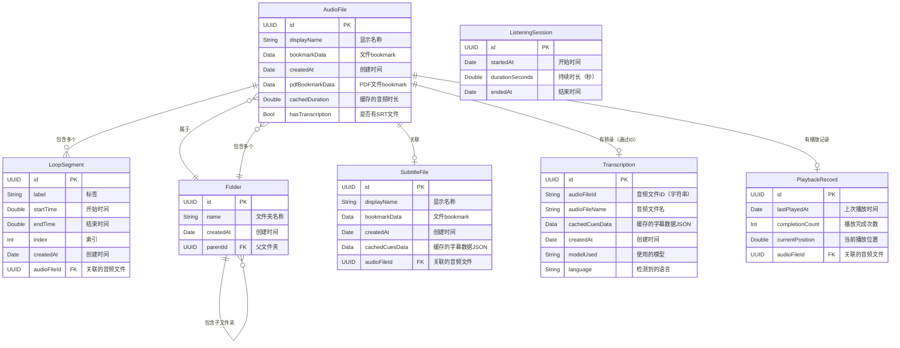
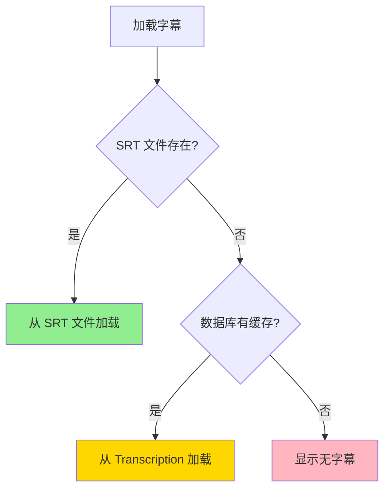

# ABPlayer 数据模型 ER 图

> [!NOTE]
> 本项目使用 **SwiftData** 而非 CoreData，但两者概念相似。本文档展示所有数据模型实体及其关系。

## 核心实体概览

ABPlayer 共有 **6 个数据模型实体**：

1. **AudioFile** - 音频文件
2. **LoopSegment** - 循环片段
3. **Folder** - 文件夹
4. **SubtitleFile** - 字幕文件
5. **Transcription** - 转录数据
6. **ListeningSession** - 收听会话

---

## 完整 ER 图



---

## 实体详细说明

### 1️⃣ AudioFile（音频文件）

**用途**：存储音频文件的核心信息和元数据

**关键字段**：
- `id`: 唯一标识符
- `displayName`: 显示名称
- `bookmarkData`: 安全作用域 bookmark，用于访问沙盒外文件
- `bookmarkData`: 安全作用域 bookmark，用于访问沙盒外文件
- `cachedDuration`: 缓存音频时长，避免重复读取
- `hasTranscription`: 标记是否存在 SRT 转录文件
- `pdfBookmarkData`: 关联的 PDF 文件

**关系**：
- 一对多：`segments` - 一个音频文件可以有多个循环片段
- 多对一：`folder` - 归属于某个文件夹
- 一对一：`subtitleFile` - 可关联一个字幕文件
- 一对一：`playbackRecord` - 关联播放记录

---

### 2️⃣ LoopSegment（循环片段）

**用途**：存储音频文件的 AB 循环片段

**关键字段**：
- `label`: 片段标签/名称
- `startTime`, `endTime`: 片段时间范围（秒）
- `index`: 排序索引

**关系**：
- 多对一：`audioFile` - 每个片段属于一个音频文件

---

### 3️⃣ Folder（文件夹）

**用途**：组织音频文件的层级结构

**关键字段**：
- `name`: 文件夹名称
- `sortedAudioFiles`: 计算属性，按文件名排序的音频列表

**关系**：
- 自引用：`parent` / `subfolders` - 支持多级文件夹嵌套
- 一对多：`audioFiles` - 包含多个音频文件

> [!TIP]
> `sortedAudioFiles` 用于保证播放顺序的一致性

---

### 4️⃣ SubtitleFile（字幕文件）

**用途**：存储外部导入的字幕文件（SRT/VTT）

**关键字段**：
- `bookmarkData`: 字幕文件的 bookmark
- `cachedCuesData`: 解析后的字幕数据（JSON 格式）
- `cues`: 计算属性，返回 `[SubtitleCue]`

**关系**：
- 一对一：`audioFile` - 关联到一个音频文件

**相关类型**：
```swift
struct SubtitleCue: Codable {
    let id: UUID
    let startTime: Double
    let endTime: Double
    let text: String
}
```

---

### 5️⃣ Transcription（转录数据）

**用途**：存储 AI 转录生成的字幕数据（历史记录）

> [!IMPORTANT]
> **注意**：Transcription 作为历史缓存，实际字幕优先从 SRT 文件加载

**关键字段**：
- `audioFileId`: 音频文件 UUID（字符串格式）
- `audioFileName`: 音频文件名（用于显示）
- `cachedCuesData`: 转录结果的字幕数据
- `modelUsed`: 使用的 WhisperKit 模型（如 "distil-large-v3"）
- `language`: 检测到的语言

**关系**：
- 通过 `audioFileId` 字符串关联 `AudioFile`（非正式外键）

**逻辑关系**：
```
AudioFile.id.uuidString === Transcription.audioFileId
```

---

### 6️⃣ ListeningSession（收听会话）

**用途**：追踪用户的收听时长会话

**关键字段**：
- `startedAt`: 会话开始时间
- `durationSeconds`: 累计收听时长
- `endedAt`: 会话结束时间（可选）

**关系**：
- 独立实体，不直接关联其他模型
- 由 `SessionTracker` 服务管理

> [!NOTE]
> 这是一个统计性实体，用于追踪总体使用时长

---

## 关系类型总结

### 7️⃣ PlaybackRecord（播放记录）

**用途**：存储音频文件的播放进度和统计信息

**关键字段**：
- `currentPosition`: 当前播放进度（秒）
- `completionCount`: 完整播放次数
- `lastPlayedAt`: 上次播放时间戳

**关系**：
- 一对一：`audioFile` - 关联到一个音频文件（级联删除）

---

## 关系类型总结

| 关系 | 类型 | 说明 |
|------|------|------|
| `AudioFile` ↔ `LoopSegment` | 1:N | 一个音频可有多个循环片段 |
| `AudioFile` ↔ `Folder` | N:1 | 多个音频属于一个文件夹 |
| `AudioFile` ↔ `SubtitleFile` | 1:1 | 一个音频关联一个字幕 |
| `AudioFile` ↔ `Transcription` | 1:N（逻辑） | 通过 UUID 字符串关联 |
| `AudioFile` ↔ `PlaybackRecord` | 1:1 | 播放进度记录（级联删除）|
| `Folder` ↔ `Folder` | 自引用 | 支持多级嵌套 |
| `ListeningSession` | 独立 | 无直接关系 |

---

## 数据存储策略

### 外部存储（`@Attribute(.externalStorage)`）

以下大型数据使用外部存储优化：
- `AudioFile.bookmarkData`
- `AudioFile.pdfBookmarkData`
- `SubtitleFile.bookmarkData`
- `SubtitleFile.cachedCuesData`
- `Transcription.cachedCuesData`

### 字幕加载优先级



---

## 设计亮点

1. **安全作用域访问**：使用 `bookmarkData` 持久化沙盒外文件访问权限
2. **性能优化**：
   - `cachedDuration` 避免重复读取音频时长
   - `hasTranscription` 避免文件系统查询
   - 外部存储优化大型数据
3. **灵活的字幕系统**：
   - 支持外部字幕文件（SubtitleFile）
   - 支持 AI 转录（Transcription）
   - SRT 文件优先，数据库作为备份
4. **层级组织**：Folder 自引用支持无限层级

---

## 相关文件

- [AudioModels.swift](file:///Volumes/Data/Code/mine/ABPlayer/ABPlayer/Sources/Models/AudioModels.swift) - AudioFile & LoopSegment
- [Folder.swift](file:///Volumes/Data/Code/mine/ABPlayer/ABPlayer/Sources/Models/Folder.swift) - Folder
- [SubtitleFile.swift](file:///Volumes/Data/Code/mine/ABPlayer/ABPlayer/Sources/Models/SubtitleFile.swift) - SubtitleFile & SubtitleCue
- [Transcription.swift](file:///Volumes/Data/Code/mine/ABPlayer/ABPlayer/Sources/Models/Transcription.swift) - Transcription
- [SessionTracker.swift](file:///Volumes/Data/Code/mine/ABPlayer/ABPlayer/Sources/Services/SessionTracker.swift) - ListeningSession
