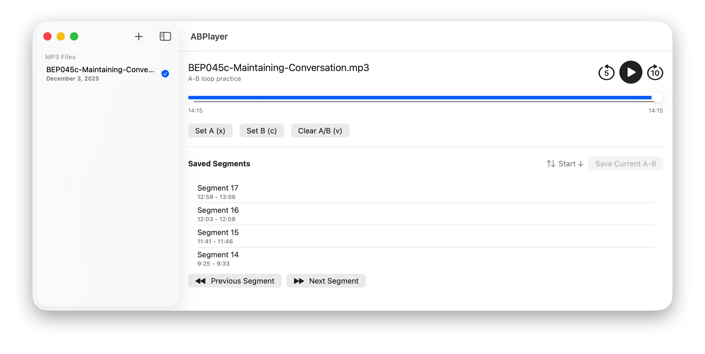

Built for language learning, phrase drills, and shadowing. Import a single file, mark with hotkeys, resume progress and segments after exit, and accumulate practice time in real time.

I use it to practice English listening. Feel free to make any requests. If you have ideas or suggestions, please open an issue. I’d be happy to implement them.
